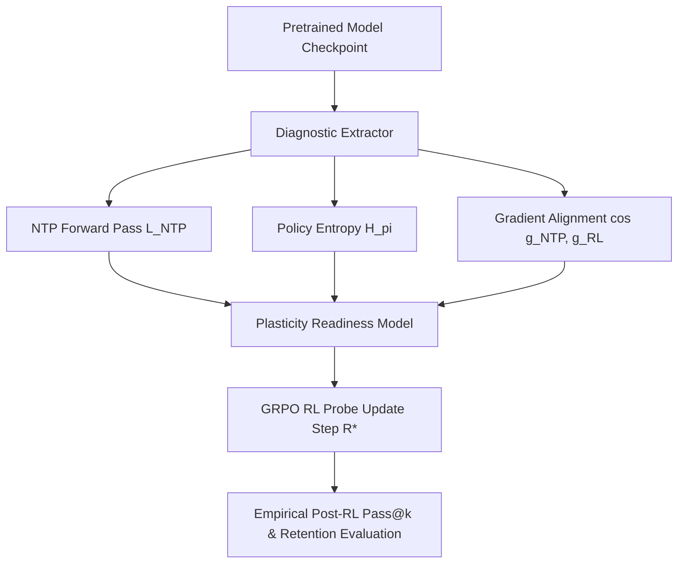

# AdaptiveRL-Forge Architecture & Diagnostic Infrastructure

## 1. System Overview
`adaptive-rl-forge` is an empirical reinforcement learning training and plasticity forecasting framework for transformer language models. It provides real PyTorch diagnostic extraction, Group Relative Policy Optimization (GRPO) training probes, and checkpoint readiness scheduling (CARLS).

## 2. Core Components
- **Diagnostic Engine (`adaptive_rl_forge/diagnostics/real_diagnostics.py`):** Calculates PyTorch forward/backward pass NTP loss $\mathcal{L}_{\text{NTP}}$, policy entropy $H(\pi_\theta)$, and gradient direction cosine similarity $\cos(\mathbf{g}_{\text{NTP}}, \mathbf{g}_{\text{RL}})$.
- **GRPO RL Probe (`adaptive_rl_forge/rl/real_grpo_probe.py`):** Executes Group Relative Policy Optimization parameter updates ($R^*$) with reward advantage normalization over prompt group rollouts.
- **Readiness Forecaster:** Linear/Ridge regression model predicting post-RL task gain $\Delta \text{RL}$ from pre-RL diagnostic vectors.
- **Empirical Provenance Validator (`scripts/validate_empirical_artifacts.py`):** Enforces 100% hash integrity and generation JSONL verification on all empirical dataset outputs.

## 3. Data Flow & Provenance
All model checkpoints produce `run_metadata.json`, parameter SHA-256 state hashes, pre-RL generation logs (`pre_rl_generations.jsonl`), and post-RL generation logs (`post_rl_generations.jsonl`) persisted under `artifacts/empirical/runs/`.
